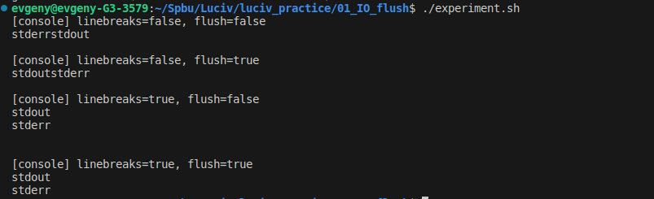

# Report Task: 01.IO_flush
## Software
- OS: Ubuntu 20.04.6 LTS
- Compiler: gcc 9.4.0

## Usage
`.\experiment`

## Results
### Console



### File Output.txt
```
[output.txt] linebreaks=false, flush=false
stdoutstderr

[output.txt] linebreaks=false, flush=true
stdoutstderr

[output.txt] linebreaks=true, flush=false
stdout
stderr


[output.txt] linebreaks=true, flush=true
stdout
stderr
```